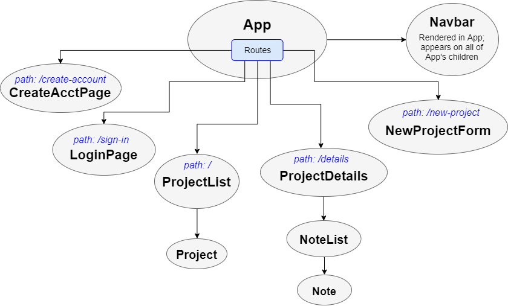

# _Project Tracker_

#### _A personal project tracker app using C# and React, 25 Nov 2019_

#### By _**Ethan Samuels-Ellingson and Jacqueline Remmel**_

## Description

_In this application, a user can create an account and log in to view their projects (ie. freelance contracts, job applications, etc). Upon selecting a project, the user then sees the details for that project, including a list of any timestamped notes they may have added._

_React Component Structure:_

 

## Setup/Installation Requirements

* _Clone this repository_
* _To start the React app:_
  * _Navigate to the "frontend-react" directory_
  * _Run the command "npm install"_
  * _Run the command "npm run start"_
  * _Go to the URL "http://localhost:8080/" in a browser_
* _To start the C# API:_
  * _Navigate to the "api" directory_
  * _Run the command "dotnet restore"_
  * _Run the command "dotnet ef database update"_
  * _Run the command "dotnet watch run"_
    * _To visit Swagger documentation for the API, go to the URL "http://localhost:5000/swagger/" in a browser after starting the watcher (with "dotnet watch run")_

_Once both the API and the react app are running, you may visit "http://localhost:8080/" in a browser and log in as the test user (username and password are both "test") to see sample data._

## Project Vision

_This project was primarily an opportunity to create a full-stack application using C# on the backend and React on the frontend. While this main goal has been achieved, only partial CRUD (Create, Read, Update, and Delete) functionality has been implemented for projects and notes. Implementing full CRUD functionality for both projects and notes in both the React app and the API is one of several ongoing goals as we continue to improve this project._

## Technologies Used

* _C#_
* _ASP.NET Core_
* _JavaScript_
* _React_
* _Webpack_
* _ESLint_
* _Babel_
* _SQL_
* _Entity_
* _Swashbuckle/Swagger_
* _Materialize_
* _CSS_
* _HTML_

### License

*Open-source*

Copyright (c) 2019 **_Ethan Samuels-Ellingson and Jacqueline Remmel_**